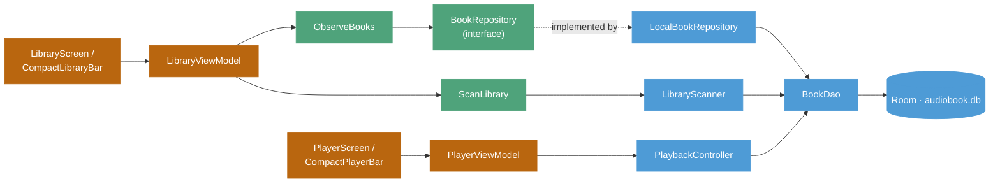
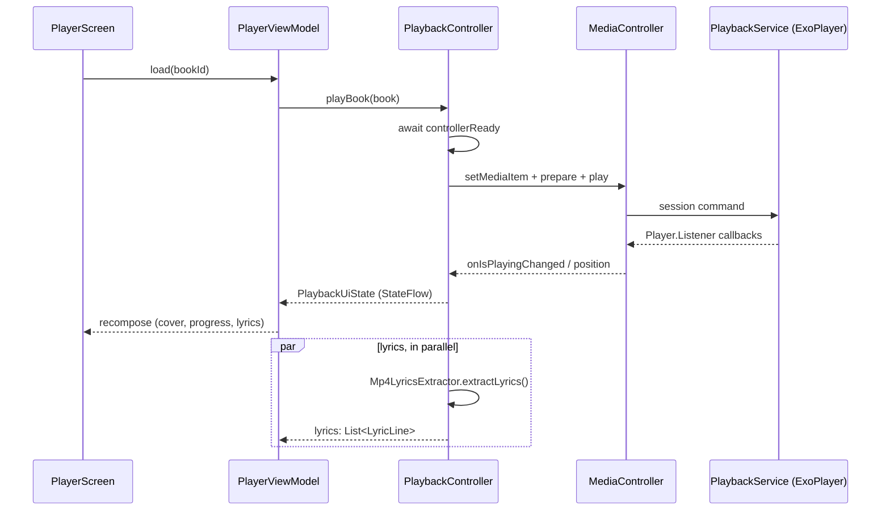

# AudioBook Architecture

**Package:** `com.ivi.audiobook`
**Stack:** Kotlin, Jetpack Compose, Hilt, Room 2.8.4 (local) / 2.4.0 (product build), Media3 (ExoPlayer), Coil 2
**Min SDK:** 32
**Deployment target:** Automotive PHUD strip display, right half of a 3840×208 screen (1920×208 usable)

## 1. Overview

AudioBook is a single-activity Compose application that discovers audiobook files on internal storage and USB, tracks per-book playback position, and plays them back through a Media3 foreground service. The codebase follows a Clean Architecture split into `domain`, `data`, and `presentation` layers, with a single Hilt dependency graph and a single Room database.

The project was built iteratively against a phone first, then retargeted mid-build to a fixed-size automotive strip display shared with a sibling launcher-widget application (`com.ivi.widgetptop`) on the same physical screen. As a result, both the Library and Player screens are now driven by the original phone-era ViewModels but rendered through new compact Compose layouts sized for that display.

## 2. Module Map

```
com/ivi/audiobook/
  AudioBookApp.kt              @HiltAndroidApp
  MainActivity.kt              Right-half screen split + Crossfade(Library ⇄ Player)

  domain/                      Pure Kotlin, no Android dependencies
    model/                     Book, LibraryQuery, LyricLine
    repository/                BookRepository (interface)
    usecase/                   ObserveBooks, ScanLibrary, SavePlaybackProgress

  data/                        Room, Media3, and filesystem I/O
    local/                     AudioBookDatabase, BookDao, BookEntity
    library/                   LibraryScanner, UsbVolumeObserver
    lyrics/                    Mp4LyricsExtractor
    playback/                  PlaybackController, PlaybackService
    repository/                LocalBookRepository, EntityMappers

  di/                          Hilt modules
    DatabaseModule.kt
    RepositoryModule.kt

  presentation/                Compose UI + ViewModels
    library/                   LibraryScreen, LibraryViewModel, CompactLibraryBar
    player/                    PlayerScreen, PlayerViewModel, CompactPlayerBar
    components/                PlaybackControlBar, VideoSeekBar, ScriptView, BookCoverCard, LibraryHeaderBar, …
    navigation/                AppRoute
    theme/                     Color, Theme, Type

  util/
    StoragePermissions.kt
```

`presentation/components/BookCoverCard.kt` and `LibraryHeaderBar.kt` are leftovers from the original phone grid layout. They are no longer referenced but have not been deleted.

## 3. Layered Architecture

Presentation depends only on domain use-cases and on `PlaybackController`. Domain depends on nothing Android-specific. Data implements the domain-owned `BookRepository` interface and is the only layer that touches Room, the filesystem, or Media3 directly.



One deliberate exception to the use-case pattern: `PlayerViewModel` talks directly to `PlaybackController` rather than going through a use-case. Playback is stateful and session-bound in a way that does not fit the request/response shape of the other use-cases, so it is exposed as a Hilt-scoped singleton that the view-model reads a `StateFlow` from.

## 4. Library Flow

`MediaStore` was evaluated and rejected: on the target hardware, the OEM's own indexing service populates a private catalog rather than rows a third-party `MediaStore` query can see. `LibraryScanner` instead walks storage volumes directly.

1. **`StorageManager.storageVolumes`** — enumerates internal storage and any mounted USB volume. Requires `MANAGE_EXTERNAL_STORAGE`, the only permission path that reliably reads raw `/mnt/media_rw/…` paths on this hardware.
2. **`LibraryScanner.walkForSupportedFiles()`** — a recursive filesystem walk per volume, skipping hidden and system folders. Files are matched by extension (currently `.m4b`). Metadata is extracted via `MediaMetadataRetriever`; embedded cover art is extracted once and cached to `filesDir/covers/{hash}.jpg`.
3. **`BookDao` — hash/path dedup** — an existing path is unhidden if needed; an existing hash found at a new path updates the book's location in place (handles a file moved between internal storage and a USB drive); otherwise a new row is inserted.
4. **`removeOrHideMissingBooks(forced)`** — an automatic scan only *hides* a book when its volume is mounted but the file is gone. A forced rescan (the library screen's refresh button) deletes unreachable books outright, mounted or not — the explicit "clean up my library" action.
5. **`ObserveBooks` → `LibraryViewModel.uiState` → `CompactLibraryBar`** — Room's `Flow` re-emits on every write. `UsbVolumeObserver`, which registers both `StorageManager.StorageVolumeCallback` and the legacy `ACTION_MEDIA_MOUNTED`/`UNMOUNTED`/`EJECT` broadcasts, triggers an automatic rescan on every USB attach or detach.

## 5. Playback Flow

`PlaybackController` is the single Hilt-singleton bridge between the UI and a Media3 `MediaController` connected to `PlaybackService`. It owns the only mutable playback state in the app.



### Position persistence

Position is written every 5 seconds while playing, and immediately on pause, seek, or close — always via `runBlocking` at those three exit points, since a fire-and-forget write risks losing the position if the process is killed right after the user backgrounds the app.

### Controls, deliberately reduced

The compact strip UI has no play/pause button by design: opening a book auto-plays, and finishing a drag-seek always resumes playback regardless of the state before the gesture. Hold-to-rewind/fast-forward, playback speed, and auto-advance-on-finish were all removed during development. Previous/next navigate between *books*, not chapters.

## 6. Persistence Model

One table, `books`, schema version 2. `fallbackToDestructiveMigration()` is used with no arguments rather than migrations, since there is no user data worth preserving yet.

| Column | Type | Notes |
|---|---|---|
| `_id` | `Long` | Primary key, autogenerate |
| `file_path` | `String` | Unique index — dedup key alongside hash |
| `is_internal` | `Boolean` | Set from `StorageVolume.isPrimary` at scan time |
| `title` / `author` | `String?` | From metadata tags, falls back to filename |
| `duration_ms` | `Long` | |
| `cover_path` | `String?` | Cached JPEG in `filesDir/covers/`, keyed by hash |
| `hash` | `String?` | MD5 — dedup and move-detection across volumes |
| `added_date` / `last_open_date` | `Long` | `last_open_date` bumps on every open |
| `position_ms` / `position_timestamp` | `Long` | `position_timestamp` only bumps when position actually changed |
| `hidden` | `Boolean` | Soft-delete for a mounted volume whose file went missing |

## 7. Dual UI Targets

The project pivoted mid-build from a phone-first two-screen layout to a fixed 3840×208 automotive strip display shared with a sibling launcher-widget app. AudioBook now renders only in the right half — a `Row` with a blank `Spacer` for the left half, matching that sibling app's own split — with a compact bar replacing the original grid and full-screen player.

| | Original (phone) | Current (automotive strip) |
|---|---|---|
| Library | `LazyVerticalGrid` of covers with a search/sort/refresh header | No header. Title/author of the focused book (567×208) + a custom drag carousel of covers (1279×208) |
| Player | Full-screen, cover-free, always-visible transport bar, tap-driven lyrics | Round cover bounded in a shared glow-backdrop asset, drag-seek progress bar, teleprompter-style lyric preview with animated line transitions |
| Layout | Sized to whatever the device reports, landscape-oriented | Fixed 567×208 / 1279×208 split, identical on both screens |
| Palette | Dark theme approximating the original mockup | Pure black ground, cyan `#00D7DB` accent, matched to the sibling widget app |

The Library carousel's drag mechanics were ported from a sibling video app's non-lazy rail component: a raw drag offset plus an `Animatable` settle offset that commits at most one slot per gesture, rather than `LazyRow` with a snap fling behavior.

Both screens are driven by the same `LibraryViewModel` / `PlayerViewModel` state as before — only the Compose layer changed.

## 8. Cross-Cutting Concerns

**Storage access.** `StoragePermissions` wraps `Environment.isExternalStorageManager()` — All Files Access, granted through a Settings screen rather than a runtime dialog, so the library re-checks grant state on every return to the app instead of trusting an activity-result code.

**USB attach/detach.** `UsbVolumeObserver` registers both the modern `StorageManager.StorageVolumeCallback` and the legacy `ACTION_MEDIA_MOUNTED`/`UNMOUNTED`/`EJECT` broadcasts, since neither alone was proven reliable across this hardware's Android version.

**Synced lyrics.** `Mp4LyricsExtractor` hand-walks the MP4 box structure (`moov → udta → meta → ilst → ©lyr → data`) via raw `RandomAccessFile` seeks, with no full-file load, to pull an embedded iTunes-style LRC lyric track, then parses `[mm:ss.xx]` timestamps. Only files tagged that way produce anything; everything else returns an empty list.

**Dependency graph.** Two Hilt modules: `DatabaseModule` provides the Room instance and DAO; `RepositoryModule` binds `BookRepository → LocalBookRepository`. Everything else — scanner, controller, use-cases — is constructor-injected directly.

## 9. Constraints & Decisions

**Room version skew.** Local development runs Room 2.8.4; the actual product build targets Room 2.4.0. `fallbackToDestructiveMigration()` is called with no arguments specifically because the boolean-argument overload only exists in 2.8.4 — the no-arg form is the one both versions share.

**No MediaStore, anywhere.** Dropped entirely, not just for USB. The OEM's own indexer maintains a catalog third-party queries cannot see, on internal storage as well as removable, so `MANAGE_EXTERNAL_STORAGE` plus a direct filesystem walk replaced it uniformly rather than keeping MediaStore as a fallback path.

**Git scope discipline.** The remote history intentionally excludes generated and build files — pushes are scoped to Kotlin sources and the manifest only, with no Gradle wrapper, no `res/`, and no IDE files — an explicit choice made early and kept consistent across every push since.
